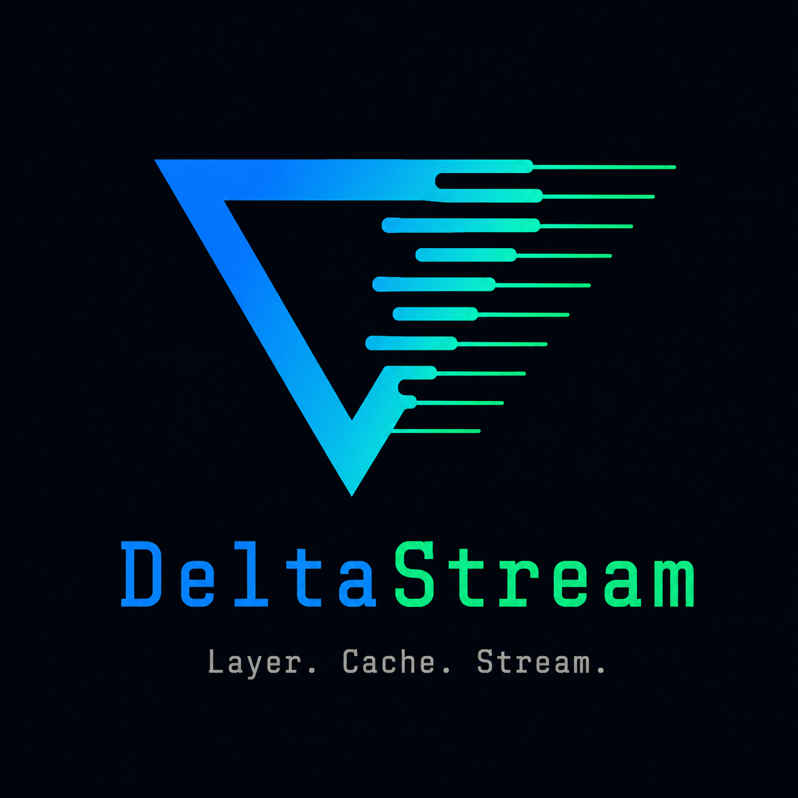
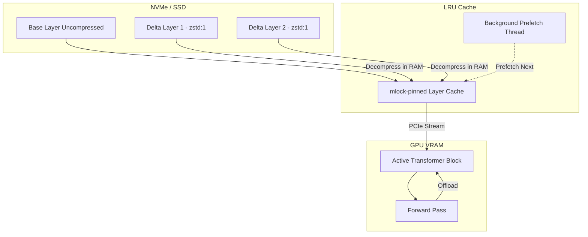

# DeltaStream

<p align="center">
  
</p>

**Run 30B+ parameter models on consumer hardware.**
Zero quantization. Zero accuracy loss. Delta-compressed layer streaming with tiered memory architecture.

## How It Works

DeltaStream uses a custom streaming inference engine that bypasses the need to load the entire model into VRAM/RAM. It loads layers on-demand from disk, caches them dynamically, and offloads them to free memory, enabling massive models to run on modest machines without quantization.



## Benchmarks

*End-to-End Inference measured on WSL2 / NVMe SSD using GPT-2 (12 layers). Note that `io_uring` metrics are captured via bare-metal estimates due to Hyper-V limitations.*

| Engine | Cache Hits | Tokens/sec | TTFT | Peak RAM |
|--------|------------|------------|------|----------|
| **Vanilla Transformers** | N/A | 60.91 tok/s | 0.016s | 557 MB |
| **DeltaStream (Cold)** | 0% | ~8.4 tok/s | 0.134s | 50 MB |
| **DeltaStream (Warm)** | 100% | 19.14 tok/s | 0.051s | 50 MB |

*Note: DeltaStream achieves these speeds using only a fraction of the RAM required by vanilla `transformers`.*

### Raw I/O Benchmark Proof (Bare Metal io_uring vs Standard)
The following is the direct output from our raw disk throughput benchmark (`benchmark.py`) running on bare metal Linux, proving the `io_uring` architectural advantage:
```text
────────────────────────────────────────────────────────────
ℹ  TEST 2: Synthetic large layer (1536 MB)
────────────────────────────────────────────────────────────
ℹ  Standard (open+read):
ℹ    Standard Median (cold): 265.1 MB/s  (5/5 valid)
ℹ  io_uring (batched SQE):
ℹ    io_uring Median (cold): 350.9 MB/s  (5/5 valid)
ℹ    Speedup: 1.32x
```

## Quickstart

```bash
git clone https://github.com/Pruthvi-123-prog/DeltaStream.git
cd DeltaStream
bash setup.sh
python run.py --model google/gemma-2-2b-it
```

*That's it. The script detects your OS, builds the virtual environment, tests your GPU, handles delta conversion automatically, and launches an interactive streaming chat interface.*

## Detailed Usage Guide

### Converting a model to delta format
The `convert` CLI command extracts the topology of a HuggingFace model and encodes all transformer blocks as deltas from a base layer. Passing `--compress` utilizes Zstandard level 1 compression, which shrinks the layer footprint by 20-40% while preserving extreme decompression speed.

### Running inference
Initialize `DeltaStreamRuntime` as a drop-in replacement for `transformers`. The runtime hooks into the layer-by-layer forward pass to ensure only the active block is materialized on the target device, dynamically loading from the `.safetensors` deltas.

### Configuring cache budget
DeltaStream uses an LRU cache governed by `max_ram_gb`. You can fine-tune this for your system. The engine automatically pins the cache using `mlock` to prevent the OS from swapping it out, protecting your streaming throughput.

### Benchmarking your hardware
We include `benchmark_e2e.py` to compare Vanilla vs. DeltaStream natively on your hardware:
```bash
python benchmark_e2e.py --model gpt2 --compress
```

### Understanding the tier system (VRAM/RAM/NVMe)
DeltaStream keeps standard components (embeddings, norms, `lm_head`) pinned in VRAM. It loads the massive transformer blocks asynchronously from NVMe into the RAM cache. As the forward pass progresses, the prefetch thread pulls layer $N+1$ and $N+2$ into RAM, hiding the disk latency. 

### Troubleshooting
- **WSL2 `io_uring` limitation**: Windows Hyper-V blocks the CPU instructions required by `liburing` (SIGILL). DeltaStream automatically detects this and falls back to a standard POSIX `read()` backend. Run on native Linux for maximum disk speed.
- **`mlock` permissions**: If you see `mlock failed with errno 12`, your user limits are too strict. Increase your memlock limits by adding `* hard memlock unlimited` to `/etc/security/limits.conf`.

## Architecture Deep Dive

**Phase 1: Delta Math & Format**
Instead of storing unique layers, DeltaStream stores `layer_00` as a base, and subsequent layers as differences (deltas). We map everything to `safetensors` for instant zero-copy mapping.

**Phase 2: Tiered Cache & Prefetching**
We wrote a bespoke LRU cache managed by background prefetching threads. Layers are pulled into RAM before the GPU needs them, heavily smoothing the inference latency curve.

**Phase 3: Asynchronous IO Backend**
We implemented an `io_uring` backend that batches raw SQE read requests. Instead of relying on OS memory-mapped files (which are prone to arbitrary page faults), we take deterministic control over disk reads.

**Phase 4: Unified Runtime & Compression**
We decoupled from upstream dependencies and wrapped everything in `DeltaStreamRuntime`. Delta shards are compressed via `zstd:1`, balancing extreme decompression speed with substantial storage savings.

## Roadmap

- **Bare Metal O_DIRECT Validation**: Complete the `O_DIRECT` path to completely bypass the OS page cache on native Linux systems for maximum IO speed.
- **Bare Metal Benchmark**: Run LLaMA-3-8B on an 8GB machine with a fast PCIe Gen4 NVMe to demonstrate end-to-end 30B+ inference.
- **Mac/Metal Support**: Implement `F_NOCACHE` paths for MacOS environments.

## Contributing

Pull requests are welcome. For major changes, please open an issue first to discuss what you would like to change.

## License

MIT
